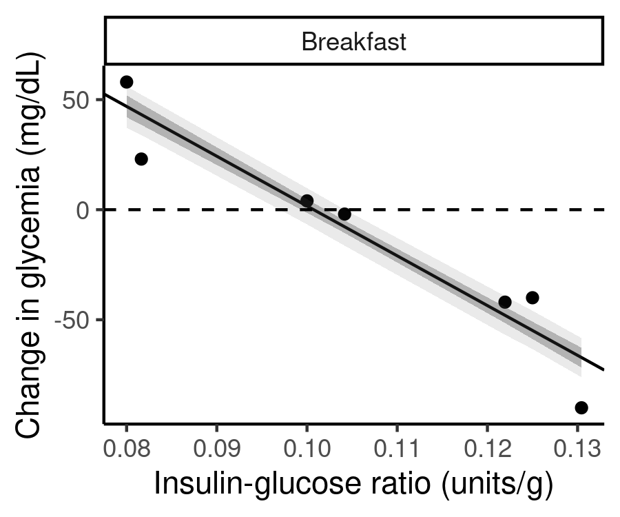

# diabetes

Tracking of my diabetes.

It is going to be important to estimate by insulin-to-glucose ratio properly, and apply those ratios well in everyday life.
This is functional insulinotherapy, which allows me to adapt my insulin injections to my glucose intake, and not the other way around.
I have kind of been doing this so far, but very approximately and in a sloppy way.
Let's get back on track and do a better job.

Short-term plan:
- Phase 1: estimate the ratio. For a couple of days, record glycemic data around breakfast (this is where calculations are the simplest).
- Phase 2: apply the ratio. Over a period of a few months, pick some meals where to properly estimate glucose intake, and use the ratio accordingly.
- Phase 3: either build a better intuition for glucose estimation without weighing everything, or get into the habit of weighing everything, always.

